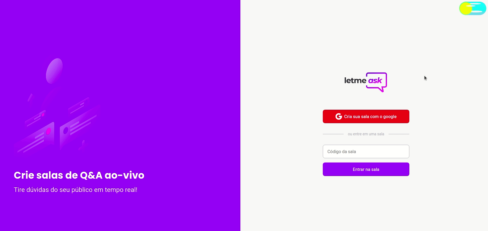
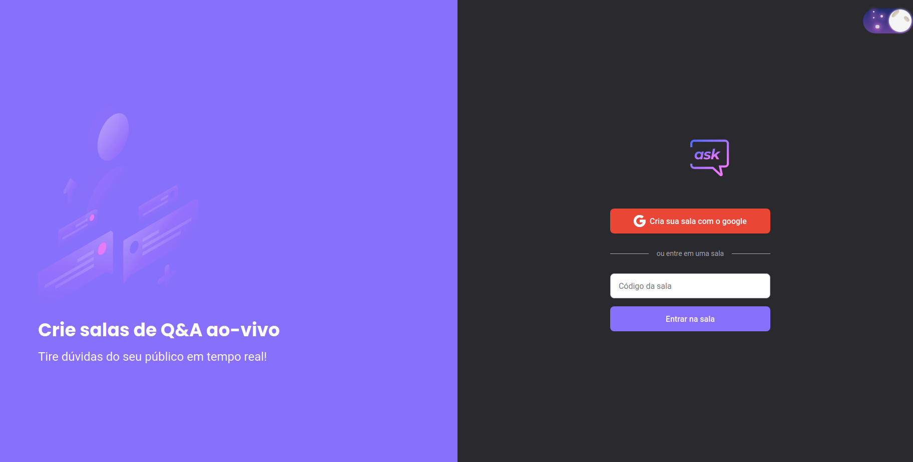
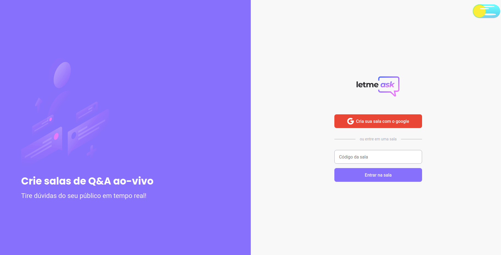
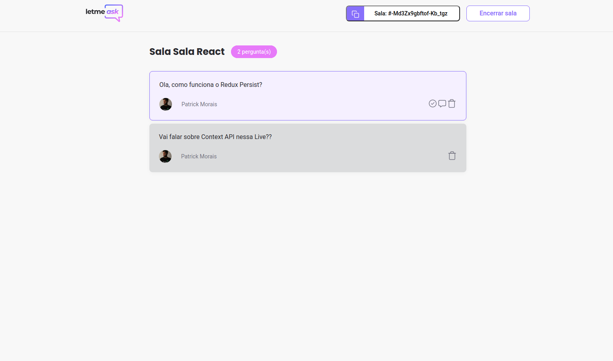
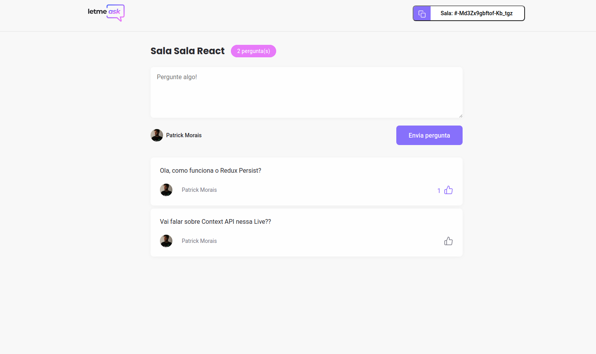

<h1 align="center">Letmeask</h1>
 

# :pushpin: Index
- [Project Media](#camera_flash-project-media)
- [About](#monocle_face-about)
- [Technologies](#rocket-technologies)
- [Author](#closed_book-author)
 

---
# :camera_flash: Project Media

 

---
# :monocle_face: About
Project proposed at NLW (Next Level Week) with the goal of being a live Q&A room.
 

---

# :rocket:  Technologies
This project was developed with the following technologies:  
- :heavy_check_mark: **React**
- :heavy_check_mark: **SASS**
- :heavy_check_mark: **Typescript**
- :heavy_check_mark: **Firebase**
  
 

---

# :closed_book: Author
By Patrick Morais.
### :link: LinkedIn: https://www.linkedin.com/in/patrick-morais/